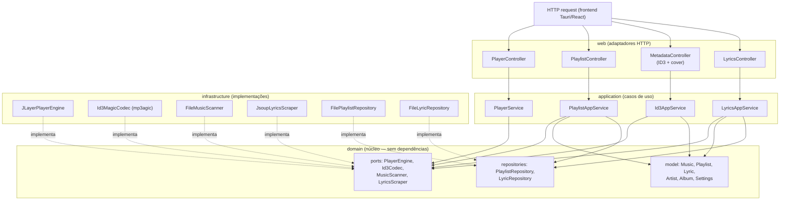
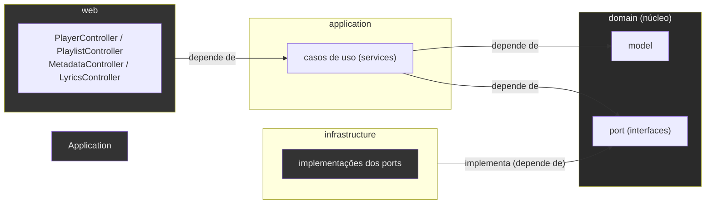
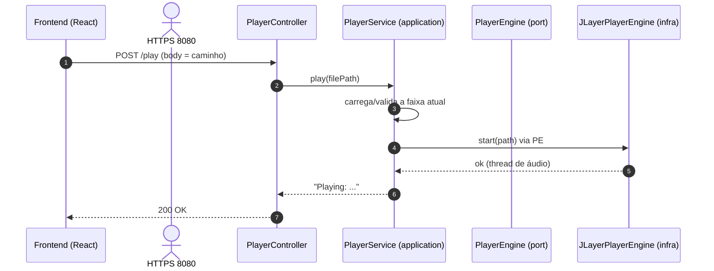
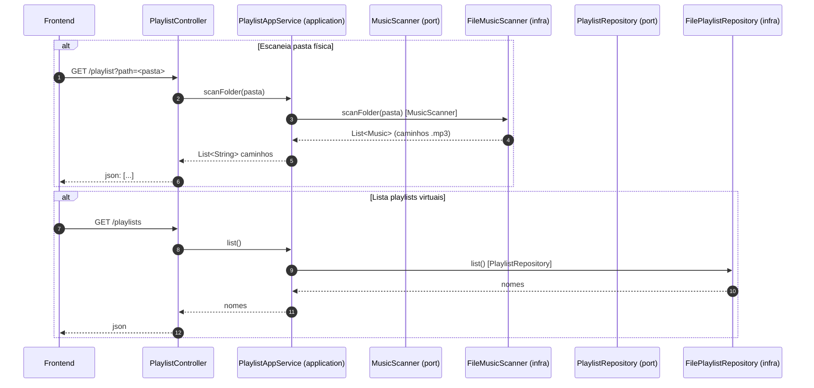
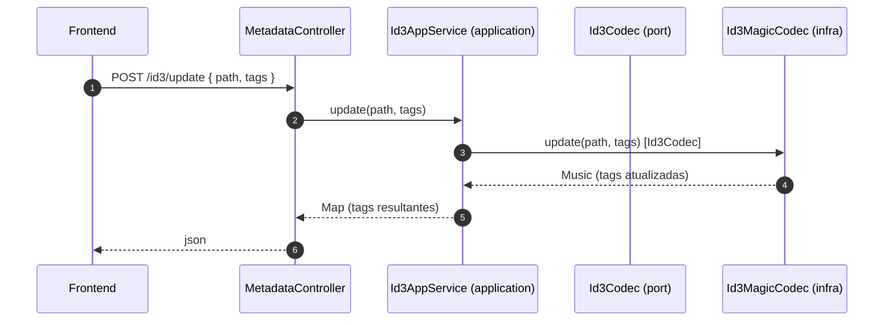
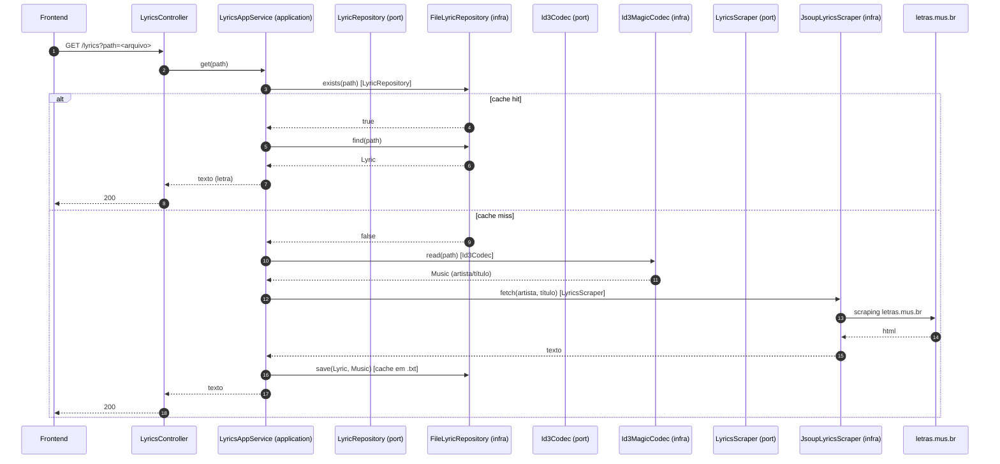
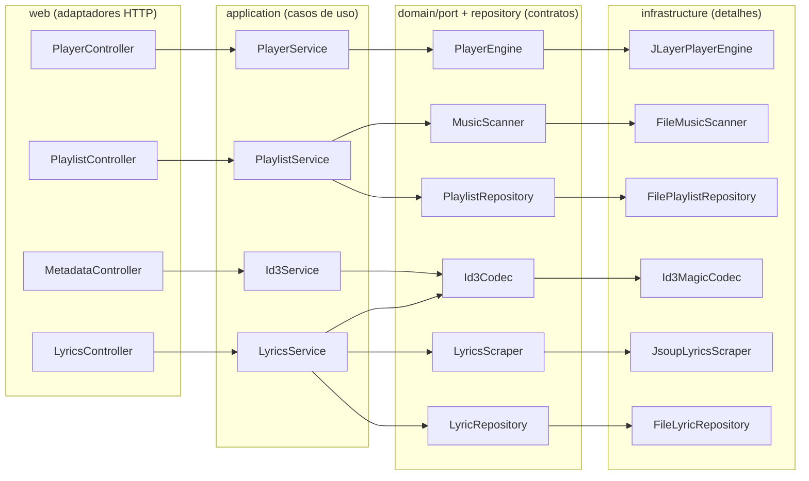

# Diagramas de Interação das Camadas

Diagramas [Mermaid](https://mermaid.js.org/) que mostram como uma requisição atravessa as camadas do backend (Clean Architecture/DDD) e como os objetos colaboram por caso de uso.

Todos os casos de uso seguem o mesmo padrão:

```
web (Controllers) ──> application (AppService) ──> domain ports/repositories
                                                      │
                                                      └──> infrastructure (adapters)
```

O controller **só traduz** HTTP ↔ chamadas de serviço. O service **orquestra** os ports. A infra **implementa** o acesso a arquivo/sistema/biblioteca. O domínio **não depende de nada**.

---

## 1. Visão geral das camadas e do fluxo



Alguns nós acima são ilustrativos (PL/PS etc. correspondem ao desenho da árvore de pacotes). O essencial: **as setas que cruzam camadas apontam do detalhe para o contrato**, nunca o contrário.

---

## 2. Regra de dependência (Hexagonal / Ports & Adapters)



- **application** conhece **domain** (interfaces `port`/`repository` + `model`), nunca a `infrastructure`.
- **infra** implementa as interfaces do domínio.
- A injeção é feita no runtime pelo Spring (o detalhe é entregue ao núcleo).

---

## 3. Caso: reproduzir um MP3 (`POST /play`)



O mesmo fluxo vale para `pause`, `stop`, `resume`, `seek`: o controller só repassa o comando e o `PlayerService` traduz para o `PlayerEngine`, que delega ao `JLayerPlayerEngine`.

---

## 4. Caso: escanear pasta física e listar playlists (`GET /playlist?path=...` e `/playlists`)



- Criar (`POST /playlist`), carregar (`GET /playlist/{name}`), renomear (`/playlist/rename`) e excluir (`DELETE /playlist/{name}`) seguem o mesmo padrão, trocando apenas o método do **repositório** (`save`, `load`, `rename`, `delete`).

---

## 5. Caso: editar tags ID3 (`POST /id3/update`)



Leitura (`GET /id3`) e bulk (`POST /id3/bulk`) usam `read(path)` / iteração do mesmo `Id3Codec`.

---

## 6. Caso: buscar letra (`GET /lyrics`)



`GET /lyrics/cached` usa só o ramo "cache hit": `exists` → `find`, e devolve `404` se não houver letra salva.

---

## 7. Resumo: quem chama quem (suas por serviço infra)



A seta `contrato --> detalhe` representa a **injeção de dependência** feita pelo Spring: o `application` depende da interface, mas recebe (em runtime) a implementação concreta.

---

Para gerar estes diagramas localmente, use a extensão Mermaid do editor ou [mermaid.live](https://mermaid.live) copiando o bloco ` ```mermaid ` desejado. No GitHub eles renderizam automaticamente.