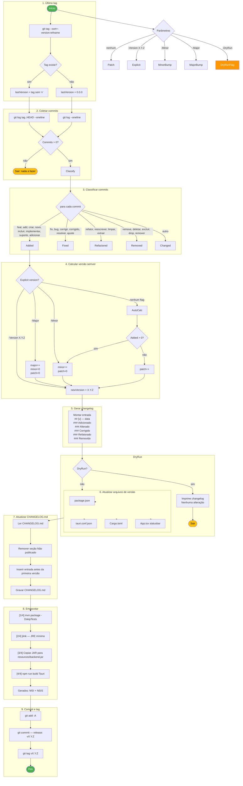

# build-release.ps1 — Fluxograma

```mermaid
flowchart TD
    Start([Início]) --> Params{Parâmetros}

    Params -->|"nenhum"| Patch
    Params -->|"-Version X.Y.Z"| Explicit
    Params -->|"-Minor"| MinorBump
    Params -->|"-Major"| MajorBump
    Params -->|"-DryRun"| DryRunFlag

    subgraph Step1 ["1. Último tag"]
        Start --> GitTag["git tag --sort=-version:refname"]
        GitTag --> HasTag{Tag existe?}
        HasTag -->|sim| LastVer["lastVersion = tag sem 'v'"]
        HasTag -->|não| ZeroVer["lastVersion = 0.0.0"]
    end

    subgraph Step2 ["2. Coletar commits"]
        LastVer --> GitLog["git log tag..HEAD --oneline"]
        ZeroVer --> GitLogAll["git log --oneline"]
        GitLog --> HasCommits{Commits > 0?}
        GitLogAll --> HasCommits
        HasCommits -->|não| Exit0([Sair: nada a fazer])
        HasCommits -->|sim| Classify
    end

    subgraph Step3 ["3. Classificar commits"]
        Classify --> ForEach{"para cada commit"}
        ForEach -->|"feat, add, criar, novo, incluir, implementar, suporte, adicionar"| Added
        ForEach -->|"fix, bug, corrigir, corrigido, resolver, ajuste"| Fixed
        ForEach -->|"refator, reescrever, limpar, extrair"| Refactored
        ForEach -->|"remove, deletar, excluir, drop, remover"| Removed
        ForEach -->|outro| Changed
    end

    subgraph Step4 ["4. Calcular versão semver"]
        Added --> HasExplicit{Explicit version?}
        HasExplicit -->|"-Version X.Y.Z"| NewVer["newVersion = X.Y.Z"]
        HasExplicit -->|"-Major"| MajorCalc["major++<br>minor=0<br>patch=0"]
        HasExplicit -->|"-Minor"| MinorCalc["minor++<br>patch=0"]
        HasExplicit -->|nenhum flag| AutoCalc
        MajorCalc --> NewVer
        MinorCalc --> NewVer
        AutoCalc --> HasAdded{Added > 0?}
        HasAdded -->|sim| MinorCalc
        HasAdded -->|não| PatchCalc["patch++"]
        PatchCalc --> NewVer
    end

    subgraph Step5 ["5. Gerar changelog"]
        NewVer --> ChangelogEntry["Montar entrada<br>## [v] — data<br>### Adicionado<br>### Alterado<br>### Corrigido<br>### Refatorado<br>### Removido"]
    end

    subgraph DryRunBranch ["DryRun"]
        ChangelogEntry --> DryRunCheck{DryRun?}
        DryRunCheck -->|sim| DryPrint["Imprime changelog<br>Nenhuma alteração"]
        DryPrint --> ExitDry([Sair])
        DryRunCheck -->|não| Step6
    end

    subgraph Step6 ["6. Atualizar arquivos de versão"]
        Step6 --> PkgJson["package.json"]
        Step6 --> TauriConf["tauri.conf.json"]
        Step6 --> CargoToml["Cargo.toml"]
        Step6 --> AppTsx["App.tsx statusbar"]
    end

    subgraph Step7 ["7. Atualizar CHANGELOG.md"]
        Step6 --> ReadChangelog["Ler CHANGELOG.md"]
        ReadChangelog --> RemoveUnpub["Remover seção Não publicado"]
        RemoveUnpub --> InsertEntry["Inserir entrada antes da primeira versão"]
        InsertEntry --> WriteChangelog["Gravar CHANGELOG.md"]
    end

    subgraph Step8 ["8. Empacotar"]
        WriteChangelog --> Jar["[1/4] mvn package -DskipTests"]
        Jar --> Jlink["[2/4] jlink — JRE mínimo"]
        Jlink --> CopyJar["[3/4] Copiar JAR para resources/backend.jar"]
        CopyJar --> TauriBuild["[4/4] npm run build Tauri"]
        TauriBuild --> Installers["Gerados: MSI + NSIS"]
    end

    subgraph Step9 ["9. Commit e tag"]
        Installers --> GitAdd["git add -A"]
        GitAdd --> GitCommit["git commit — release: vX.Y.Z"]
        GitCommit --> GitTagCreate["git tag vX.Y.Z"]
        GitTagCreate --> Done([Fim])
    end

    style Start fill:#4CAF50,color:#fff
    style Done fill:#4CAF50,color:#fff
    style Exit0 fill:#FFC107,color:#000
    style ExitDry fill:#FFC107,color:#000
    style DryRunFlag fill:#FF9800,color:#fff
```
